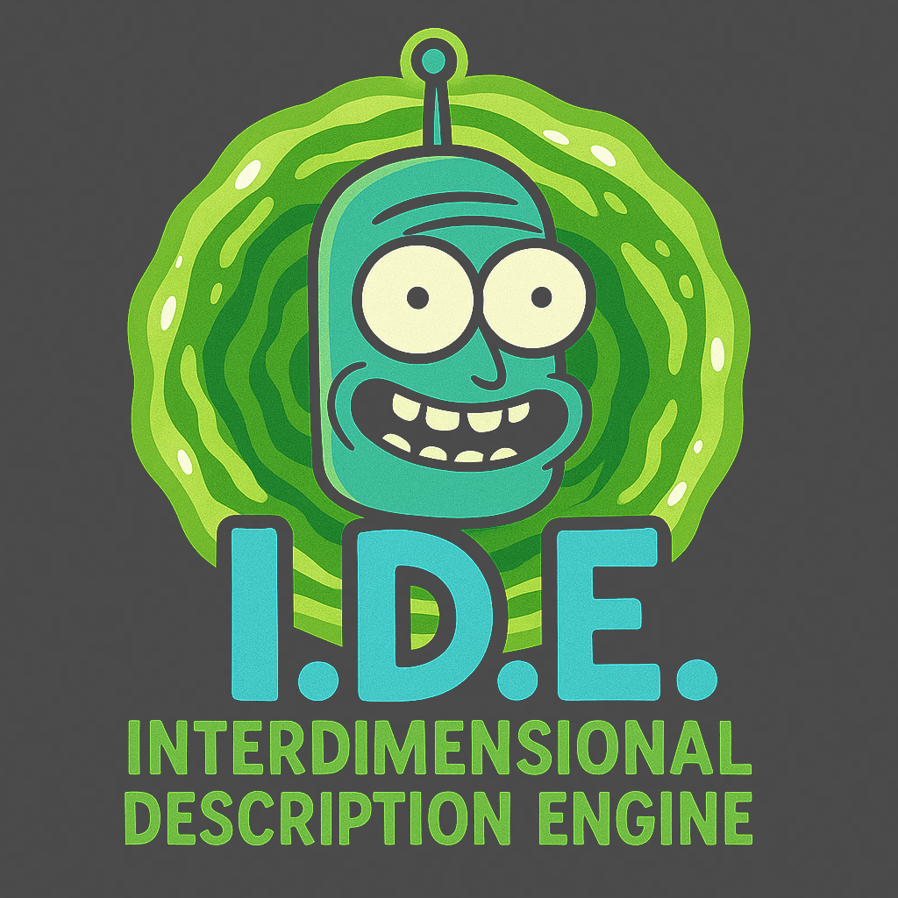

# Project for Nfactorial 2nd Tour


**Живое приложение:** [https://nfactorial2-iota.vercel.app/](https://nfactorial2-iota.vercel.app/)

## Описание проекта

Nfactorial 2 Tour — это проект, созданный для демонстрации навыков разработки и проектирования веб-приложений с использованием Angular и FastAPI. Цель проекта — предоставить пользователям понятный и функциональный интерфейс для взаимодействия с данными из Rick and Morty API. Также реализована генерация описание для персонажей через Gemini AI.


## Инструкции по установке и запуску

1.  **Клонируйте репозиторий:**
    ```bash
    git clone [https://github.com/mossimka/Nfactorial2.git](https://github.com/mossimka/Nfactorial2.git)
    cd Nfactorial2
    ```

2.  **Установка и запуск Frontend (Angular):**
    * Перейдите в папку фронтенда:
      ```bash
      cd front
      ```
    * Установите зависимости (убедитесь, что у вас установлен Node.js):
      ```bash
      npm install
      ```
    * Запустите приложение в режиме разработки:
      ```bash
      npm start
      ```
      Или стандартной командой Angular CLI:
      ```bash
      ng serve
      ```
      Приложение будет доступно по адресу `http://localhost:4200`.

3.  **Установка и запуск Backend (FastAPI):**
    * Вернитесь в корневую папку и перейдите в папку бэкенда:
      ```bash
      cd ../back
      ```
    * Создайте и активируйте виртуальное окружение:
      ```bash
      python -m venv venv
      source venv/bin/activate # для Linux/macOS
      # или venv\Scripts\activate # для Windows
      ```
    * Установите зависимости Python:
      ```bash
      pip install -r requirements.txt
      ```
    * Запустите сервер FastAPI:
      ```bash
      uvicorn main:app --reload
      ```
      Сервер будет доступен по адресу `http://localhost:8000`.

## Описание процесса проектирования и разработки

Проектирование началось с обсуждения пользовательского опыта и основных функций. Использовался подход "mobile-first", чтобы обеспечить оптимальную производительность на мобильных устройствах. Затем был реализован прототип в Figma, после чего началась разработка.

Разработка велась итеративно: каждая итерация включала реализацию одной функции, тестирование и рефакторинг кода.

## Уникальные подходы и методологии

* **TypeScript** использовался для повышения надежности кода и сокращения числа ошибок на этапе разработки во фронтенде.
* Использовался **CSS** со стилями, инкапсулированными на уровне компонентов Angular, для обеспечения модульности.
* **Компонентный подход** (Angular) позволил создавать переиспользуемые UI-компоненты.
* Для серверной части использовался **Python** с фреймворком **FastAPI**, что обеспечило высокую производительность и удобство работы с асинхронными запросами.

## Компромиссы, принятые во время разработки

* Было решено использовать стандартный CSS.
* Для backend-части был выбран Python/FastAPI для демонстрации работы с этим стеком.

## Известные ошибки и проблемы

* Отсутствует полноценная обработка ошибок на серверной стороне (запросы к внешнему API могут падать).
* Не получилось интегрировать ИИ(пытался Gemini)

## Выбор технического стека

* **Angular & TypeScript** были выбраны для фронтенда из-за строгой типизации, компонентной архитектуры и богатой экосистемы. Ну и я его хорошо знаю)
* **Python & FastAPI** были выбраны для серверной части из-за высокой производительности FastAPI, асинхронной природы и удобства Python для бэкенд-разработки. Fast Api для меня был новым опытом)
